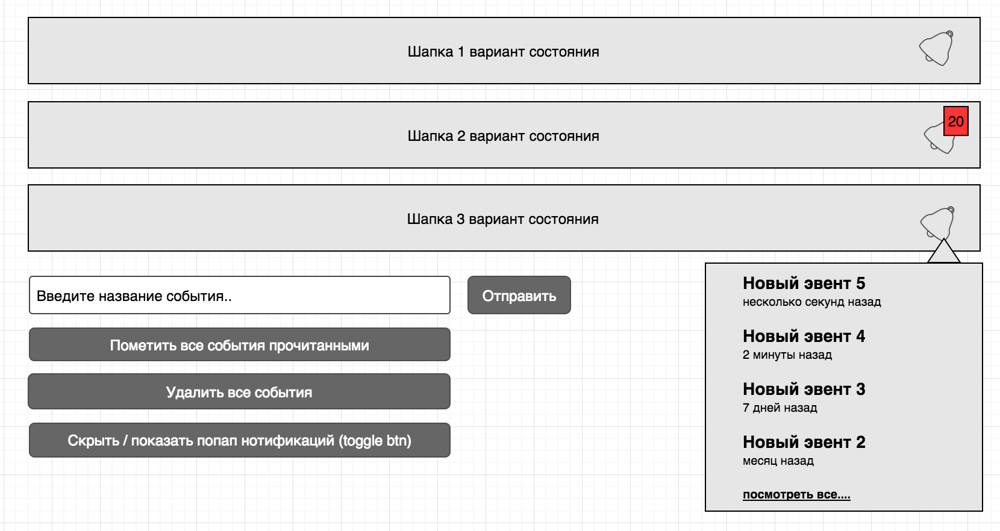

# React + Redux code demo

Demo page: [https://yoginalex.github.io/react-code-example/](https://yoginalex.github.io/react-code-example/)

### Выполнено с использованием

- Base env by `create-react-app`.
- [MaterialUI](http://www.material-ui.com/)
- React + Redux
- SCSS

### Суть задачи - Написать простое приложение с использованием React / Redux / CSS Modules / (es6+) на основе вайрфрейма.

Необходимо заставить работать иконку нотификаций в шапке, все кнопки и покрыть redux часть тестами.

 - Popover должен открываться с анимацией;
 - Ссылка “посмотреть все” должна просто закрывать popover;
 - Popover должен показывать только 5 последних событий;
 - Каждые x секунд (например 20) должно приходить новое событие с рандомным текстом.

